# 💳 Sentiric Payment Service - Mantık ve Akış Mimarisi

**Stratejik Rol:** Ödeme işlemleri için tek bir adaptör görevi görür. Platformun geri kalanı (Agent, Billing) hangi ödeme ağ geçidinin (Stripe, Iyzico, vs.) kullanıldığını bilmek zorunda değildir.

---

## 1. Temel Akış: Ödeme Başlatma (InitiatePayment)

Bu servis, gelen ödeme isteğini alır, yapılandırılmış adaptörü kullanarak harici servise iletir ve sonucu platformun anladığı bir formata çevirir.

```mermaid
sequenceDiagram
    participant Agent as Agent Service / Billing
    participant Payment as Payment Service
    participant Stripe as Harici Ödeme Adaptörü (Stripe)

    Agent->>Payment: InitiatePayment(amount, user_id, ...)
    
    Note over Payment: 1. Adaptör Seçimi ve Veri Hazırlığı
    Payment->>Stripe: /charge API isteği
    Stripe-->>Payment: Transaction Result
    
    Note over Payment: 2. Sonucun Normalizasyonu
    Payment-->>Agent: InitiatePaymentResponse(status: completed)
```

## 2. Adaptör Mimarisi

Payment Service, PaymentAdapter adı verilen bir Go arayüzü ile farklı ödeme sağlayıcılarını destekleyecektir.
* internal/adapters/stripe.go
* internal/adapters/iyzico.go
* internal/payment_gateway.go (Ana mantığı içerir)